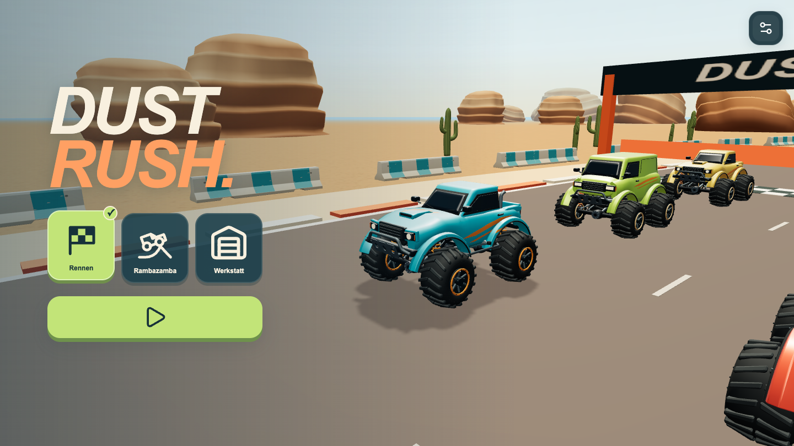
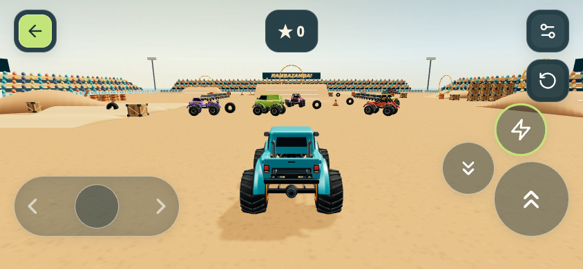

# DUST RUSH — Monstertrucks

Große Reifen. Große Sprünge. Und ordentlich Wumms. Baue deinen eigenen Monstertruck, rase durch die Wüste und lass es in der Arena krachen. DUST RUSH ist ein kinderfreundliches 3D-Arcade-Spiel für Handy und Computer.

**[▶ Jetzt kostenlos im Browser spielen](https://mirkoappel.github.io/dust-rush/)**

Kein Konto, keine Werbung. Einfach laden lassen, eine Spielwelt wählen und auf den großen grünen Play-Knopf tippen.

## Drei Welten für deinen Truck

### Rennen — einmal um den Kurs, dann durchs Ziel

Ab auf die Wüstenstrecke! Fahre zwischen anderen Monstertrucks über Rampen und Hindernisse. Nach einer vollständigen Runde durchs Ziel bist du fertig. Ohne Runden- und Platzanzeige steht der Fahrspaß im Mittelpunkt.

### Rambazamba — Platz für große Sprünge

Hier gibt es keine Runden und kein Zeitlimit. Nimm Anlauf, spring über Erdhügel, fahre durch Stunt-Ringe und walze Schrottautos platt. Für Sprünge, Ringe und überfahrene Autos sammelst du Punkte.

### Werkstatt — dein Truck, deine Farben

Vier Karosserien, vier Reifensätze, vier Fahrwerkshöhen und vier Motoren: Kombiniere deinen Lieblingstruck und ergänze Spoiler, Lampen und Dekore. Jede Kategorie bietet vier Varianten; acht Farben machen den Truck zu deinem.

Die Farbleiste färbt das gerade ausgewählte Bauteil. Die Teilebilder zeigen die Farbe gleich mit. Tippst du erneut auf einen gewählten Spoiler, ein Lampenset oder ein Dekor, baust du es wieder ab. Deinen Truck kannst du frei drehen und näher heranholen – auf dem Handy durch Ziehen und Pinchen, am Computer auch mit dem Mausrad.

Deine Konfiguration bleibt in diesem Browser gespeichert und fährt in beiden Spielwelten mit.

## Losfahren ist einfach

**Am Handy:** Links tippen oder schieben zum Lenken. Rechts gibt der große Knopf Gas. Der Blitz darüber gibt Gas mit Nitro; der Abwärtspfeil bremst und lässt den Truck driften. Weiter festhalten, wenn er steht, fährt rückwärts. Du kannst zwischen den rechten Knöpfen gleiten, ohne den Daumen abzuheben.

Der Ring um den Blitz zeigt deinen Nitro-Vorrat. Er lädt sich nach einer Pause wieder auf. Ist er leer, gibt der Blitz weiterhin normales Gas. Wenn du die Steuerung loslässt, rollt der Truck aus. Neigelenkung ist optional in den Einstellungen zuschaltbar.

**Am Computer:**

| Taste | Funktion |
| --- | --- |
| ← / → | Lenken |
| Leertaste | Gas |
| ↑ | Gas mit Nitro |
| ↓ | Bremsen, driften und bei weiterem Halten rückwärts |
| R | Truck zurücksetzen |
| Esc / P | Pause und weiter |

Der grüne Zurück-Pfeil führt ins Hauptmenü. In den Einstellungen kannst du pausieren, den Ton ändern und – sofern dein Browser es unterstützt – Vollbild einschalten.

## Auch als App

Öffne das Spiel zunächst online und lass es vollständig laden. In unterstützten Browsern kannst du es anschließend zum Startbildschirm hinzufügen und mit gespeicherter Offline-Kopie auch ohne Netz spielen.

- **Android:** Im Browsermenü „App installieren“ oder „Zum Startbildschirm hinzufügen“.
- **iPhone / iPad:** In Safari „Teilen“ → „Zum Home-Bildschirm“.

Für normale Spielupdates ist keine Neuinstallation nötig. Neue Versionen werden beim Start mit Internet vorbereitet; während des Spielens erfolgt kein automatischer Neustart. Truck und Farben bleiben lokal gespeichert.

## Hinter den Kulissen

Wie DUST RUSH entstanden ist, welche Entwürfe dahinterstecken und wie Modelle, Physik und Steuerung funktionieren, findest du in der [Entwicklungsdokumentation](docs/DEVELOPMENT.md). Dort stehen auch die Anleitungen zum lokalen Bauen und Testen sowie die [Lizenzhinweise](docs/DEVELOPMENT.md#technik-und-lizenzen).

Alle Bilder auf dieser Seite sind echte Screenshots des Spielstands vom 25. September 2026. Konzeptbilder und gestalterische Zielbilder sind getrennt in der Entwicklungsdokumentation gekennzeichnet.
