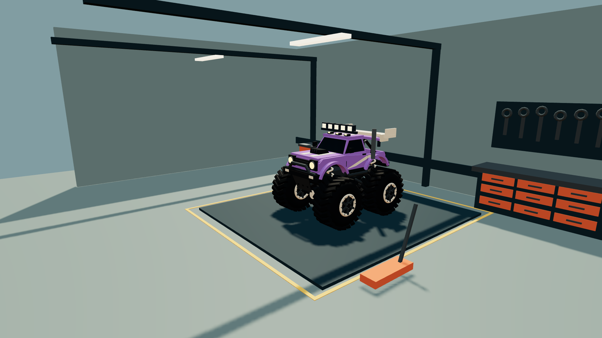

# DUST RUSH — Monstertrucks

Große Reifen. Große Sprünge. Und ordentlich Wumms. Ein kinderfreundliches 3D-Arcade-Rennen mit sechs Monstertrucks, drei Runden und einem Zielband zum Durchbrechen.

**KI-Experiment:** Dieses Projekt ist zugleich ein spielerischer Praxistest des KI-Modells **Astra**. Im gemeinsamen Dialog werden Spielideen entwickelt, umgesetzt, ausprobiert und verbessert – von der 3D-Grafik über Fahrphysik und Handy-Steuerung bis zur Veröffentlichung. Im Mittelpunkt steht, wie weit sich ein spielbares Projekt mit KI-Unterstützung iterativ entwickeln lässt; es handelt sich nicht um einen standardisierten Benchmark.

## Jetzt spielen

**[▶ Spielbare Demo auf GitHub Pages](https://mirkoappel.github.io/dust-rush/)**

Kein Konto, keine Werbung, kein Download nötig. Rennstrecke oder Arena auf einer Bildkarte auswählen, auf den großen grünen **▶** tippen und selbst Gas geben. In der dritten Bildkarte, der Werkstatt, baust du deinen eigenen Truck mit Farben, Reifen, Fahrwerk und Anbauteilen.

[](https://mirkoappel.github.io/dust-rush/)

## Einfach einsteigen

**Ohne Lesen:** Eine Rennstrecke mit Zielflagge steht fürs Rennen, ein springender Truck für die Arena und die Garage mit Schraubenschlüssel für die Werkstatt. Der grüne Dreiecksknopf startet. Im Pausenmenü bedeuten ▶ weiterspielen, der Kreis-Pfeil neu anfangen und das Haus zurück zur Auswahl. Lautsprecher und Handy-Symbol zeigen ihren eingeschalteten Zustand mit einem Häkchen. Weitere Einstellungen und Erklärungen für Erwachsene liegen hinter ⚙ ···.

**Am Handy:** Gerät quer und bequem wie ein Lenkrad halten, dann **▶** antippen. Falls gefragt, den Bewegungssensor erlauben. Du lenkst durch Drehen. **In beiden Spielarten gibst du selbst Gas:** grünes Pedal gedrückt halten, rotes Pedal zum Bremsen. Rot nach dem Stillstand weiter halten fährt rückwärts. Bei aktiver Handy-Lenkung liegt Gas unter dem rechten Daumen und die Bremse unter dem linken; beide Pedale sitzen groß an den unteren Bildschirmrändern. Ohne Sensor liegen die Lenktasten links und die Pedale rechts. Ohne Sensorsignal oder ohne Erlaubnis erscheinen große Links-/Rechts-Tasten. Unter Pause → ⚙ ··· lässt sich die Lenkung mit „Gerade halten“ neu ausrichten.

**Am Computer:** Mit ← / → oder A / D lenken. In beiden Spielarten fährt der Truck nur mit ↑ / W oder dem grünen Pedal; ↓ / S beziehungsweise das rote Pedal bremsen. Es gibt keine automatische Lenkhilfe und kein automatisches Gas. Die wenigen Anzeigen lassen viel Platz fürs Rennen; Tacho und Zeit sind optional.

| Taste | Funktion |
| --- | --- |
| ← / → oder A / D | Lenken |
| ↑ oder W | Gas geben |
| ↓ oder S | Bremsen und rückwärts |
| R | Zurück auf die Strecke |
| Esc oder P | Pause / weiter |
| M | Ton an / aus |
| F | Vollbild, falls unterstützt |

## Monstertruck-Feeling

**Zwei Spielarten plus Werkstatt:** „Rennen“ führt über drei Runden durch die Wüste. „Rambazamba“ ist eine freie Monstertruck-Show in einer Arena: sieben Sprunghügel, zwei Reihen mit insgesamt zehn Schrottautos, viele lose Hindernisse, weitere Trucks und Tribünen. Keine Uhr läuft ab, keine Runde muss geschafft werden. Einfach Anlauf nehmen, springen, crashen und ausprobieren. Über Pause → Kreis-Pfeil wird die Arena wieder aufgeräumt.

**Werkstatt:** Die dritte Bildkarte führt in eine eigene 3D-Halle mit Werkbank, Werkzeugwand, Ersatzreifen und Wagenheber. Drei Bildreiter öffnen Lack, Reifen/Fahrwerk und Anbauteile. Vier Karosseriefarben und drei Akzentfarben lassen sich mit Standard- oder Riesenreifen, normalem oder hohem Fahrwerk, einem großen Stunt-Spoiler, fünf Dachscheinwerfern und Show-Auspuffrohren kombinieren. Jede Änderung wird sofort am Truck sichtbar. Die Konfiguration bleibt lokal im Browser gespeichert und wird in Rennen und Arena übernommen. Das Haus bringt dich zurück zur Spielauswahl.



Die Werkstatt verändert das Erscheinungsbild, den Federungsaufbau und die Abrollgröße. Sie ist kein Leistungs-Upgrade-System: Höchsttempo und die verzeihende Arcade-Abstimmung gelten weiterhin für alle Varianten.


- Sechs farbige Trucks auf einer geschlossenen Wüsten-Rennstrecke.
- Riesige Reifen mit vier unabhängig gefederten Rädern, sichtbaren Schraubenfedern und gedämpften Landungen.
- Vier Bodenkontakte, Schwerkraft, Trägheit und seitlicher Reifengrip; Rampen, kleine Hügel und Rüttelwellen für Sprünge und Lastwechsel.
- Gegenseitige Stoßimpulse zwischen Trucks, gedämpfte Wandkontakte und seitliche Rampenkollisionen statt Hochsetzen auf die Rampe.
- Pylonen, Kisten, Fässer und lose Reifen, die weggestoßen werden, rollen und auskullern.
- Neun Schrottautos auf der Rennstrecke beziehungsweise zehn in der Arena, die sich überfahren und plattdrücken lassen.
- Staub, Crash-Effekte und lokal erzeugter Motorsound.
- Drei Runden mit geordneten Kontrollpunkten, Zielband und einem großen „Noch mal!“-Knopf.

Die Physik ist bewusst spielerisch und verzeihend, keine technisch genaue Fahrzeugsimulation. Große Bildknöpfe und Pedale erleichtern Kindern den Einstieg; Gas, Bremse und Lenkung bleiben vollständig in ihrer Hand.

Das normale Tempo liegt auf ebenem Boden ungefähr bei **55 km/h im Rennen und 40 km/h in der Arena**. Es gibt keinen Turbo mehr. Gefälle und Stöße können das Tempo kurzzeitig verändern; die Arena-Sprunghügel sind auf Anlauf mit normalem Tempo abgestimmt. Weicher Gasaufbau, gedämpfte Federung und eine ruhigere Kamera geben mehr Zeit zum Lenken. Beim Absprung beeinflusst weit entfernter Boden nicht mehr den Karosseriewinkel; der Truck behält eine ruhige Fluglage. Die Physik läuft in festen 120-Hz-Schritten, während die Darstellung Zwischenstände glättet. Grafikprogramme werden vor dem Start vorbereitet, um Anfahr-Ruckler zu verringern.

## Als App installieren

Die Demo ist eine Progressive Web App (PWA). Einmal online öffnen und vollständig laden lassen; danach kann das Spiel auch ohne Netz starten.

- **Android / unterstützte Browser:** Im Browser „App installieren“ oder „Zum Startbildschirm hinzufügen“ wählen. Falls der Browser es anbietet, erscheint auch „Installieren“ in den Spieleinstellungen.
- **iPhone / iPad:** Die Demo in Safari öffnen, „Teilen“ → „Zum Home-Bildschirm“ wählen.

Installation und Sensorzugriff hängen vom Browser und Gerät ab. Die PWA benötigt HTTPS; GitHub Pages stellt das bereit. Spielupdates werden angeboten und nicht mitten im Rennen automatisch neu geladen. Es gibt keine Analyse-Skripte oder Telemetrie; Bestzeiten bleiben im Browser.

## Ohne Server spielen

Die fertige `index.html` enthält den kompletten Spielcode, alle Styles und das 3D-Modell. Die Datei herunterladen und in einem aktuellen Browser mit WebGL öffnen: Für dieses lokale Spiel werden weder Node.js noch Server oder Internet benötigt. Auf dem Mac öffnet auch `Spiel starten.command` die lokale HTML-Datei.

Der direkte Dateistart und die installierbare Web-App sind zwei verschiedene Wege: PWA-Installation und zuverlässiger Sensorzugriff nutzen die HTTPS-Demo. Lokal bleiben Tastatur und Touch-Tasten verfügbar, soweit das Betriebssystem lokale HTML-Dateien im Browser ausführt.

## Entwickeln

Node.js installieren, das Repository klonen und im Projektordner ausführen:

```sh
npm ci
npm run build
npm test
npm start
```

Die optionale Entwicklungsvorschau läuft auf [localhost:4177](http://127.0.0.1:4177/). Änderungen am Quellcode brauchen erneut `npm run build` und ein Neuladen im Browser. Der Build erzeugt die eigenständige `index.html`, App-Symbole und einen versionierten Service Worker. Esbuild bündelt das Spiel; Sharp erzeugt die PNG-Symbole aus dem SVG.

| Pfad | Aufgabe |
| --- | --- |
| `src/page.html`, `style.css` | Oberfläche und responsive Gestaltung |
| `src/game.mjs` | Eingaben, Anzeigen und Spielablauf |
| `src/tilt.mjs` | Kalibrierte Handy-Lenkung in beiden Querformaten |
| `src/simulation.mjs` | Rennen, Gegner und Oberflächenkontakte |
| `src/physics.mjs` | Kräfte, Reifengrip, vier Radkontakte und Truck-Stoßimpulse |
| `src/obstacles.mjs` | Bewegliche Hindernisse und Impulse |
| `src/arena.mjs` | Freestyle-Arena und Hindernis-Anordnung |
| `src/suspension.mjs` | Vier-Rad-Federung und Lastwechsel |
| `src/world.mjs` | 3D-Welt, Truck-Animation und Kamera |
| `src/customization.mjs`, `src/truck-addons.mjs` | Geprüfte Truck-Konfiguration und sichtbare Anbauteile |
| `src/workshop.mjs` | Eigene 3D-Werkstatthalle |
| `src/audio.mjs` | Motorsound und Effekte |
| `src/pwa.mjs`, `manifest.webmanifest` | Installation und Offline-Integration |
| `src/service-worker.template.js` | Vorlage für den versionierten Offline-Cache |
| `assets/monstertruck.glb` | Eigenes Monstertruck-Modell |
| `docs/gameplay.png` | Echter Screenshot der Spielgrafik |
| `tests/` | Automatische Tests |

GitHub Pages veröffentlicht den Branch `main` aus dem Root-Verzeichnis. Die Datei `.nojekyll` sorgt für die unveränderte statische Auslieferung. Relative URLs unterstützen den Unterpfad `/dust-rush/`.

## Prüfungen und Grenzen

Die Tests prüfen vollständige Drei-Runden-Rennen, Rundenzählung, korrigierte Lenkrichtung, langsamere Zielgeschwindigkeit, manuelles Gas in beiden Spielarten ohne Lenkhilfe, Ruhe im Stand, sanftes Anrollen, entfernte Turbo-Steuerung, Sprünge in beiden Richtungen, stabile Flugwinkel an Rampenkanten, Federwege, Landungsdämpfung, seitliche Rampenkollisionen, Impulserhaltung bei Truck-Kollisionen, Hindernis-Impulse, plattgedrückte Autos, Bildkarten, Werkstatt-Teile, Reifengröße und Bodenkontakt, Pedale, Handy-Winkel, Manifest-Symbole und die Offline-Antwort des Service Workers. Außerdem wird geprüft, dass die einzelne HTML-Datei das vollständige GLB enthält und keine Skripte oder Styles nachladen muss.

Die Desktop-Browservorschau wurde mit Rennstart, Arena, Bildauswahl und Pausenmenü geprüft; vollständige Rennen werden zusätzlich simuliert. Die responsive Oberfläche wurde auch in Handy-Hoch- und Querformat geprüft. Die Handy-Sensorberechnung und das Verhalten der Arena werden ebenfalls automatisiert geprüft; ein Test mit einem echten Smartphone steht noch aus. Der automatisierte Testbrowser erlaubt keinen direkten `file://`-Aufruf, deshalb ist dieser Startweg strukturell geprüft, nicht dort tatsächlich ausgeführt.

## Technik und Lizenzen

Three.js, GLTFLoader und BufferGeometryUtils sind lokal in Revision 167 enthalten; ihre MIT-Lizenz steht in [vendor/THREE-LICENSE.txt](vendor/THREE-LICENSE.txt) und ist zusätzlich in die HTML-Datei eingebettet. Das Truck-Modell wurde für dieses Spiel in Blender gebaut. Das Repository erteilt derzeit keine zusätzliche allgemeine Lizenz für den übrigen Spielcode oder das Modell.
