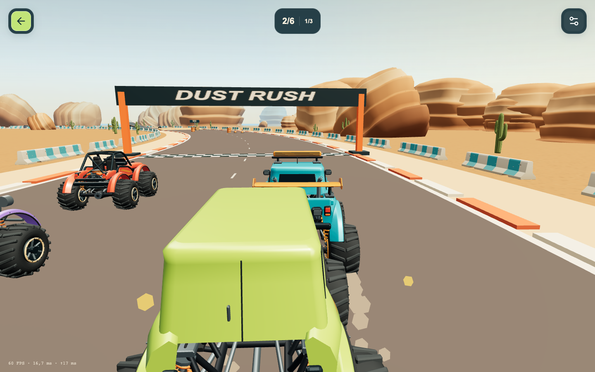
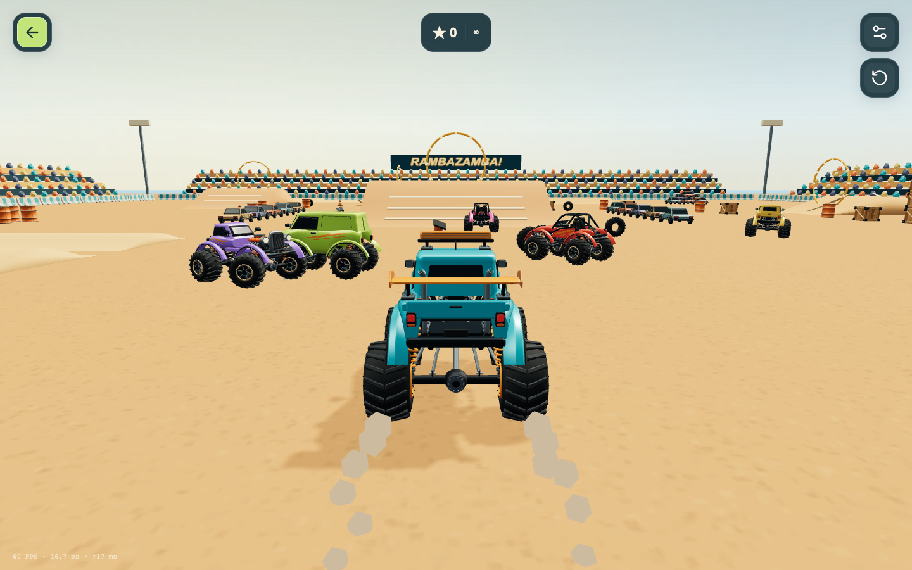

# DUST RUSH — Monstertrucks

Große Reifen. Große Sprünge. Und ordentlich Wumms. Ein kinderfreundliches 3D-Arcade-Rennen mit sechs Monstertrucks, drei Runden und einem Zielband zum Durchbrechen.

**KI-Experiment:** Dieses Projekt ist zugleich ein spielerischer Praxistest des KI-Modells **Astra**. Im gemeinsamen Dialog werden Spielideen entwickelt, umgesetzt, ausprobiert und verbessert – von der 3D-Grafik über Fahrphysik und Handy-Steuerung bis zur Veröffentlichung. Im Mittelpunkt steht, wie weit sich ein spielbares Projekt mit KI-Unterstützung iterativ entwickeln lässt; es handelt sich nicht um einen standardisierten Benchmark.

## Jetzt spielen

**[▶ Spielbare Demo auf GitHub Pages](https://mirkoappel.github.io/dust-rush/)**

Kein Konto, keine Werbung, kein Download nötig. Truck-Farbe auswählen, auf **LOS!** tippen und losfahren.

[](https://mirkoappel.github.io/dust-rush/)

## Einfach einsteigen

**Am Handy:** Gerät quer und bequem wie ein Lenkrad halten, dann **LOS!** antippen. Falls gefragt, den Bewegungssensor erlauben. Das Spiel gibt automatisch Gas; du lenkst durch Drehen. Der Blitzknopf ist der Turbo. Ohne Sensorsignal oder ohne Erlaubnis erscheinen große Links-/Rechts-Tasten. Unter ⚙ beziehungsweise Pause lässt sich die Lenkung mit „Gerade halten“ neu ausrichten.

**Am Computer:** Mit ← / → oder A / D lenken, mit Leertaste oder Shift den Turbo zünden. Automatisches Gas und sanfte Kurvenhilfe sind standardmäßig an. Die wenigen Anzeigen lassen viel Platz fürs Rennen; Tacho und Zeit sind optional.

| Taste | Funktion |
| --- | --- |
| ← / → oder A / D | Lenken |
| ↑ oder W | Gas geben |
| ↓ oder S | Bremsen und rückwärts |
| Leertaste oder Shift | Turbo |
| R | Zurück auf die Strecke |
| Esc oder P | Pause / weiter |
| M | Ton an / aus |
| F | Vollbild, falls unterstützt |

## Monstertruck-Feeling

**Zwei Spielarten:** „Rennen“ führt über drei Runden durch die Wüste. „Rambazamba“ ist eine freie Monstertruck-Show in einer Arena: sieben Sprunghügel, zwei Reihen mit insgesamt zehn Schrottautos, viele lose Hindernisse, weitere Trucks und Tribünen. Keine Uhr läuft ab, keine Runde muss geschafft werden. Einfach Anlauf nehmen, springen, crashen und ausprobieren. Über Pause → Neustart wird die Arena wieder aufgeräumt.



- Sechs farbige Trucks auf einer geschlossenen Wüsten-Rennstrecke.
- Riesige Reifen mit vier unabhängig gefederten Rädern, sichtbaren Schraubenfedern und gedämpften Landungen.
- Rampen, kleine Hügel und Rüttelwellen für Sprünge und Lastwechsel.
- Pylonen, Kisten, Fässer und lose Reifen, die weggestoßen werden, rollen und auskullern.
- Neun Schrottautos, die sich überfahren und plattdrücken lassen.
- Turbo-Felder, Staub, Crash-Effekte und lokal erzeugter Motorsound.
- Drei Runden mit geordneten Kontrollpunkten, Zielband und einem großen „Noch mal!“-Knopf.

Die Physik ist bewusst spielerisch und verzeihend, keine technisch genaue Fahrzeugsimulation. Die Kurvenhilfe erleichtert Kindern den Einstieg.

Das normale Tempo liegt ungefähr bei 95 km/h, mit Turbo kurzzeitig bei maximal 137 km/h. Sanftere Beschleunigung und eine ruhigere, etwas weiter entfernte Kamera geben mehr Zeit zum Lenken.

## Als App installieren

Die Demo ist eine Progressive Web App (PWA). Einmal online öffnen und vollständig laden lassen; danach kann das Spiel auch ohne Netz starten.

- **Android / unterstützte Browser:** Im Browser „App installieren“ oder „Zum Startbildschirm hinzufügen“ wählen. Falls der Browser es anbietet, erscheint auch „Installieren“ in den Spieleinstellungen.
- **iPhone / iPad:** Die Demo in Safari öffnen, „Teilen“ → „Zum Home-Bildschirm“ wählen.

Installation und Sensorzugriff hängen vom Browser und Gerät ab. Die PWA benötigt HTTPS; GitHub Pages stellt das bereit. Spielupdates werden angeboten und nicht mitten im Rennen automatisch neu geladen. Es gibt keine Analyse-Skripte oder Telemetrie; Bestzeiten bleiben im Browser.

## Ohne Server spielen

Die fertige `index.html` enthält den kompletten Spielcode, alle Styles und das 3D-Modell. Die Datei herunterladen und in einem aktuellen Browser mit WebGL öffnen: Für dieses lokale Spiel werden weder Node.js noch Server oder Internet benötigt. Auf dem Mac öffnet auch `Spiel starten.command` die lokale HTML-Datei.

Der direkte Dateistart und die installierbare Web-App sind zwei verschiedene Wege: PWA-Installation und zuverlässiger Sensorzugriff nutzen die HTTPS-Demo. Lokal bleiben Tastatur und Touch-Tasten verfügbar, soweit das Betriebssystem lokale HTML-Dateien im Browser ausführt.

## Entwickeln

Node.js installieren, das Repository klonen und im Projektordner ausführen:

```sh
npm ci
npm run build
npm test
npm start
```

Die optionale Entwicklungsvorschau läuft auf [localhost:4177](http://127.0.0.1:4177/). Änderungen am Quellcode brauchen erneut `npm run build` und ein Neuladen im Browser. Der Build erzeugt die eigenständige `index.html`, App-Symbole und einen versionierten Service Worker. Esbuild bündelt das Spiel; Sharp erzeugt die PNG-Symbole aus dem SVG.

| Pfad | Aufgabe |
| --- | --- |
| `src/page.html`, `style.css` | Oberfläche und responsive Gestaltung |
| `src/game.mjs` | Eingaben, Anzeigen und Spielablauf |
| `src/tilt.mjs` | Kalibrierte Handy-Lenkung in beiden Querformaten |
| `src/simulation.mjs` | Rennen, Gegner, Sprünge und Kollisionen |
| `src/obstacles.mjs` | Bewegliche Hindernisse und Impulse |
| `src/arena.mjs` | Freestyle-Arena und Hindernis-Anordnung |
| `src/suspension.mjs` | Vier-Rad-Federung und Lastwechsel |
| `src/world.mjs` | 3D-Welt, Truck-Animation und Kamera |
| `src/audio.mjs` | Motorsound und Effekte |
| `src/pwa.mjs`, `manifest.webmanifest` | Installation und Offline-Integration |
| `src/service-worker.template.js` | Vorlage für den versionierten Offline-Cache |
| `assets/monstertruck.glb` | Eigenes Monstertruck-Modell |
| `docs/gameplay.png` | Echter Screenshot der Spielgrafik |
| `tests/` | Automatische Tests |

GitHub Pages veröffentlicht den Branch `main` aus dem Root-Verzeichnis. Die Datei `.nojekyll` sorgt für die unveränderte statische Auslieferung. Relative URLs unterstützen den Unterpfad `/dust-rush/`.

## Prüfungen und Grenzen

Die Tests prüfen vollständige Drei-Runden-Rennen, Rundenzählung, korrigierte Lenkrichtung, Boost, Sprünge, Federwege, Landungsdämpfung, Hindernis-Impulse, plattgedrückte Autos, Handy-Winkel, Manifest-Symbole und die Offline-Antwort des Service Workers. Außerdem wird geprüft, dass die einzelne HTML-Datei das vollständige GLB enthält und keine Skripte oder Styles nachladen muss.

Die Desktop-Browservorschau wurde inklusive eines vollständigen Rennens, der Arena und des Spielart-Wechsels getestet. Die Handy-Sensorberechnung und das Verhalten der Arena werden ebenfalls automatisiert geprüft; ein Test mit einem echten Smartphone steht noch aus. Der automatisierte Testbrowser erlaubt keinen direkten `file://`-Aufruf, deshalb ist dieser Startweg strukturell geprüft, nicht dort tatsächlich ausgeführt.

## Technik und Lizenzen

Three.js, GLTFLoader und BufferGeometryUtils sind lokal in Revision 167 enthalten; ihre MIT-Lizenz steht in [vendor/THREE-LICENSE.txt](vendor/THREE-LICENSE.txt) und ist zusätzlich in die HTML-Datei eingebettet. Das Truck-Modell wurde für dieses Spiel in Blender gebaut. Das Repository erteilt derzeit keine zusätzliche allgemeine Lizenz für den übrigen Spielcode oder das Modell.
