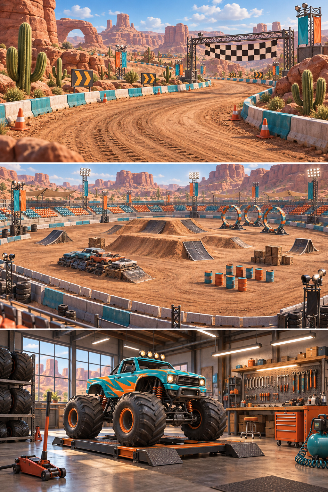
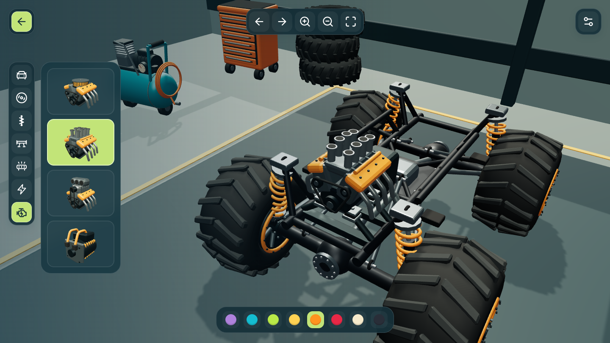

# DUST RUSH — Entwicklung und Hintergrund

[Zur Spielvorstellung und zur spielbaren Demo](../README.md)

Diese Dokumentation richtet sich an Menschen, die das Spiel verstehen, verändern oder weiterentwickeln möchten. Die README bleibt der Einstieg für Spieler. Dateipfade in Code-Schreibweise beziehen sich auf das Repository-Root.

## Entstehung und gestalterische Vision

**KI-Experiment:** Dieses Projekt ist zugleich ein spielerischer Praxistest des KI-Modells **Astra**. Im gemeinsamen Dialog werden Spielideen entwickelt, umgesetzt, ausprobiert und verbessert – von der 3D-Grafik über Fahrphysik und Handy-Steuerung bis zur Veröffentlichung. Es handelt sich nicht um einen standardisierten Benchmark.

Das Projekt liegt direkt im Ordner „Monstertruck (Game)“, einschließlich des lokalen Git-Repositorys; der frühere Unterordner „Spiel“ entfällt. Der erste Entwurf liegt unter `design/concepts/monstertruck-entwurf-v1.png`.

Unter [design/concepts](../design/concepts) liegen die erzeugten Konzeptbilder für Trucks, Teile, Streckenobjekte, Werkstattausstattung und die drei Spielwelten. `prompts.json` dokumentiert die Bildaufträge; der erste verworfene Teile-Entwurf ist entsprechend benannt. Die Bilder sind eine gestalterische Zielrichtung, keine Screenshots: Detailgrad und Lichtstimmung sind noch nicht vollständig in der Echtzeitgrafik erreicht.

[](../design/concepts/spielwelten-rennen-arena-werkstatt-v1.png)

## Lokal entwickeln

Node.js wird nur zum Bauen und Testen benötigt, nicht zum Spielen. Im Projektordner:

```sh
npm ci
npm run build
npm test
npm start
```

Die optionale Vorschau läuft auf [localhost:4177](http://127.0.0.1:4177/). Nach Quellcodeänderungen erneut bauen und den Browser neu laden. Lokal wird kein Service Worker registriert, damit alte Offline-Caches die Vorschau nicht überdecken. Esbuild bündelt das Spiel; Sharp erzeugt die App-Symbole.

## Projektaufbau

| Pfad | Aufgabe |
| --- | --- |
| `src/page.html`, `style.css` | Oberfläche und responsive Gestaltung |
| `src/game.mjs` | Eingaben, Konfiguration und Spielablauf |
| `src/ui/` | Lokale Icons, Teile-Vorschaubilder und Nahansicht |
| `src/customization.mjs` | Validierte Teile, Farben und Geometrieparameter |
| `src/vehicle-dimensions.mjs` | Gemeinsame Maße für Modelle, Aufhängung und Fahrphysik |
| `src/models/`, `src/truck-addons.mjs` | Fahrzeugvarianten, Anbauteile und Weltobjekte |
| `src/tilt.mjs` | Kalibrierte Handy-Lenkung |
| `src/vehicle-physics-profile.mjs` | Zentrales Fahrzeugprofil mit Motorleistung, Masse, Haftung, Bremse, Lenkung, Federung, Tempo und Nitro |
| `src/simulation.mjs`, `src/physics.mjs` | Rennen, Gegner, Radkontakte und Impulse |
| `src/suspension.mjs`, `src/wheel-motion.mjs` | Federung und Radanimation |
| `src/obstacles.mjs`, `src/arena.mjs` | Hindernisse und Freestyle-Arena |
| `src/world.mjs`, `src/environment.mjs` | 3D-Szene, Licht, Darstellung und Kamera |
| `src/driving-camera.mjs` | Weiche Kamerareaktion auf Nitro und Bremsen, unabhängig von der Fahrphysik |
| `src/workshop.mjs` | Werkstatthalle |
| `src/audio.mjs` | Synthetisierter Motorsound und Effekte |
| `src/pwa.mjs`, `manifest.webmanifest` | Installation und Offline-Integration |
| `src/service-worker.template.js` | Vorlage für den versionierten Offline-Cache |
| `assets/monstertruck.glb` | Erhaltener Quell-Truck und Knoten für Rad-/Lenkbewegungen |
| `assets/truck-library-v2.glb` | Karosserien, Reifen und Motoren |
| `assets/workshop-parts-v1.glb` | Vier Lampensets, vier Spoiler und der Einspritz-V8 |
| `assets/world-assets-v1.glb` | Bewegliche Hindernisse und Werkstattausstattung |
| `assets/track-assets-v1.glb` | Rampen, Barrieren, Felsen und Kakteen |
| `design/blender/`, `design/concepts/` | Editierbare Modelle und gestalterische Referenzen |
| `tests/` | Automatische Tests |

## Spielregeln und Bedienkonzept

### Steuerung und Oberfläche

Der helle Griff hebt sich vom dunklen Lenkfeld ab; bei Berührung werden weiterhin Griff und Fläche grün. Der Zurücksetzen-Knopf sitzt auf Desktop und Handy direkt links neben den Einstellungen, nicht über der rechten Fahrsteuerung. In schmalem Hochformat erhält die Arena-Punktzahl darunter eine eigene Zeile, damit die Bedienelemente frei bleiben.

**Ohne Lesen:** Die wichtigsten Bedienelemente sind Bildknöpfe. Zurück, Einstellungen und Kamera verwenden gleich große Icon-Buttons in einem gemeinsamen dunklen Toolbar-Stil. Der Zurück-Pfeil bleibt grün; bei Einstellungen bedeutet Grün tatsächlich aktiv – Vollbild beispielsweise nur im Vollbildmodus. Das Einstellungssymbol ist in allen Spielarten gleich: Antippen oder Anklicken erweitert seine Toolbar nach unten und pausiert die Fahrt. Die Leiste enthält Ton, Vollbild und am Handy die Neigelenkung. Derselbe Einstellungsknopf oder ein Tipp neben die Leiste schließt sie und setzt die Fahrt fort. Hover öffnet sie nicht. Nur in Rambazamba stehen die Punkte oben mittig; im Rennen entfallen Runden- und Platzanzeige. In der Werkstatt sitzt dort am Desktop die Kameraleiste und bleibt auch bei geöffneten Einstellungen sichtbar. Auf Geräten mit primärer Touch-Bedienung ist sie ausgeblendet: Drehen und Zoomen funktionieren direkt am Truck.

**Am Handy:** Links sitzt ein halbtransparenter horizontaler Lenkregler etwas oberhalb des unteren Bildschirmrands. Antippen setzt den Griff direkt unter den Daumen; links und rechts ziehen lenkt stufenlos; vertikale Bewegungen verändern weder Gas noch Lenkweg. Bei Berührung werden Griff und Lenkfläche grün, beim Loslassen springt der Griff in die Mitte. Rechts sitzt der größere runde Gas-Knopf, links oberhalb davon die zwei kleineren Knöpfe für Driftbremse und Nitro. Die drei einzelnen runden Knöpfe stehen ohne gemeinsame Hintergrundfläche; der abwärts gerichtete Doppelpfeil steht für Bremsen und Rückwärtsfahren. Die Bremse lässt den Truck driften und anhalten; hält man nach dem Stillstand weiter, fährt er nach einer kurzen Pause rückwärts. Der rechte Daumen kann ohne Abheben zwischen den Knöpfen gleiten. Nitro gibt zugleich Gas und zusätzlichen Schub; ist der Vorrat leer, bleibt normales Gas erhalten. Der Ring um den Blitz zeigt den Vorrat. Er reicht für fünf Sekunden Schub und lädt nach zwei Sekunden Pause langsam wieder auf. Nach leerem Vorrat muss Nitro losgelassen werden, bevor ein neuer Schub möglich ist; danach genügt auch ein kleiner neu aufgeladener Rest, ohne Vierteltank-Mindeststand. Boost benötigt Bodenkontakt; Sprünge entstehen durch den Anlauf, nicht durch künstliches Hochheben. Ohne gedrückten Gas- oder Nitro-Knopf rollt der Truck aus. Die Bedienelemente sind fest positioniert und nicht verschiebbar. Die Neigelenkung ist standardmäßig aus und lässt sich optional über das Querformat-Handy im Einstellungsmenü einschalten; erst dann gegebenenfalls den Bewegungssensor erlauben. Grün bedeutet an, ein roter Strich bedeutet aus. Auch dann bleibt der Lenkregler nutzbar: horizontales Ziehen hat Vorrang vor dem Neigen. Bei aktiver Neigelenkung gleicht die 3D-Kamera den Horizont sanft aus; die Bedienelemente bleiben fest am Bildschirm. Beim Starten und Fortsetzen wird die aktuelle Haltung als Geradeausstellung übernommen.

**Am Computer:** Mit ← und → lenken und mit der Leertaste Gas geben. Pfeil hoch gibt Gas mit Nitro, Pfeil runter bremst zum Driften und fährt bei weiterem Halten nach dem Stillstand rückwärts – genauso wie die beiden Sonderknöpfe am Handy. Die Bildschirmsteuerung ist bei Tastatur und Maus ausgeblendet. W, A und D sowie X und C bleiben Alternativen; S und die linke Umschalttaste bedienen weiterhin die normale Bremse mit Rückwärtsfahrt. Es gibt weder automatische Lenkhilfe noch automatisches Gas.

| Taste | Funktion |
| --- | --- |
| ← / → oder A / D | Lenken |
| Leertaste oder W | Gas geben |
| Linke Umschalttaste oder S | Normal bremsen und rückwärts |
| ↓ oder X | Driftbremse; weiter halten für rückwärts |
| ↑ oder C | Gas mit Nitro; leer bleibt normales Gas |
| R | Zurück auf die Strecke |
| Esc oder P | Pause / weiter |
| M | Ton an / aus |
| F | Vollbild, falls unterstützt |

### Rennen und Rambazamba

Das Rennen führt mit sechs Trucks genau einmal durch die Wüstenstrecke. Alle starten hinter der Ziellinie; nach dem vollständigen Rundkurs beendet die erste reguläre Zieldurchfahrt das Rennen. Kontrollpunkte verhindern Abkürzungen. Es gibt keine Platz- oder Rundenanzeige, auch das Ergebnis feiert das Erreichen des Ziels statt einer Platzierung. Bestzeiten für den einzelnen Rundkurs werden getrennt von den früheren Drei-Runden-Zeiten gespeichert.

Rambazamba ist eine freie Monstertruck-Show mit zwölf Sprunghügeln, sechzehn überfahrbaren Schrottautos, fünf Stunt-Ringen, gestapelten Kisten, Fässern und weiteren Trucks. Es gibt weder Zeitlimit noch Rundenzwang. Ein durchfahrener Ring bringt Punkte, ist aber keine Pflichtaufgabe. Zurück ins Hauptmenü und erneut Play starten die Arena frisch.

- Vier Radkontakte, sichtbare Schraubenfedern und gedämpfte Landungen.
- Schwerkraft, Trägheit und Reifengrip; Rampen, kleine Hügel und Rüttelwellen.
- Gegenseitige Stoßimpulse zwischen Trucks und gedämpfte Wandkontakte.
- Pylonen, Fässer, Kisten und lose Reifen, die weggestoßen werden.
- Neun Schrottautos auf der Rennstrecke und sechzehn in der Arena, die sich plattdrücken lassen.
- Einstürzende Kistenstapel, Staub, Crash-Effekte und lokal synthetisierter Motorsound.

Die Physik ist bewusst verzeihend, keine technisch genaue Fahrzeugsimulation. Alle abstimmbaren Fahrzeugwerte stehen gemeinsam im Fahrzeug-Physikprofil und werden der Rennsimulation übergeben. Motorleistung und Masse ergeben das für die Beschleunigung wirksame Leistungsgewicht; die Masse wirkt außerdem auf Zusammenstöße und Federung. Die konfigurierbare Fahrzeughaftung beschreibt vorerst den gesamten Reifensatz und wird mit einem separaten Untergrundfaktor für Asphalt oder Erde multipliziert. Einzelne Reifenmodelle erhalten noch keine festen Haftungswerte. Die Bremsverzögerung ist in g angegeben und bleibt durch die Reifen-Untergrund-Haftung begrenzt. Beim Driften sinkt nur die Seitenhaftung; die kombinierte Drift-/Rückwärtsbremse kann längs weiterhin bis zu dieser Haftungsgrenze verzögern. Das normale Tempo liegt auf ebenem Boden ungefähr bei 55 km/h im Rennen und 40 km/h in der Arena. Gefälle und Stöße können es kurzzeitig verändern. Die Physik läuft in festen 120-Hz-Schritten; die Darstellung glättet Zwischenstände. Die sichtbare Raddrehung ist gegen stroboskopisches Rückwärtslaufen begrenzt, ohne die physikalische Abrollberechnung zu ändern.

### Werkstatt und Teilevorschauen

Die Werkstatt ist eine eigene 3D-Halle mit Werkbank, Werkzeugwand, Ersatzreifen und Wagenheber. Eine vertikale Leiste mit weißen Symbolen öffnet die jeweiligen Bildoptionen:

- Vier Karosserien: Pickup, Buggy, Van und Hotrod.
- Vier Reifen: Gelände, Riesenreifen, breite Sandreifen und feinere All-Terrain-Reifen.
- Vier davon unabhängige Fahrwerkshöhen: normal, hoch, sehr hoch und extra hoch. Die neue Zwischenstufe erhöht das bisherige Maximum nicht.
- Vier Spoiler: flache Lippe, Sportspoiler, Stunt-Spoiler und spitz zulaufender Delta-Spoiler.
- Vier Lampensets: LED-Leiste, zwei runde Scheinwerfer, vier LED-Pods oder vier runde Rallye-Scheinwerfer.
- Dekore: Rennstreifen, Blitz, Flammen oder Tribal, mit eigener Farbe.
- Vier Motoren: V8, Einspritz-V8 mit acht Ansaugtrichtern, Kompressor und elektrisch.

Alle sieben Kategorien bieten jeweils genau vier Auswahlkarten. Bei Spoilern, Dachlampen und Dekoren entfernt ein erneuter Tipp auf die aktive Teilekarte die Auswahl vom Truck; ein weiterer Tipp bringt sie wieder an. Die gewählte Farbe bleibt dabei gespeichert. Es gibt keine zusätzliche „ohne“-Karte. Bei Karosserie, Reifen, Federung und Motor bleibt dagegen immer genau eine Variante ausgewählt. Der Kategorieknopf klappt ausschließlich das Menü auf oder zu und baut nichts ab. Die dezenten Varianten stehen zuerst. Der Auspuff folgt automatisch dem Motor und hat keine eigene Auswahl. Alte eingeschaltete Spoiler und Lampen werden als Stunt-Spoiler und vier Dachlampen übernommen.

Die Bauteilauswahl kommt ohne sichtbaren Text aus; zugängliche Namen für Screenreader bleiben erhalten. Unten stehen ausschließlich Farbfelder. Sie färben das gerade gewählte Teil: Karosserie, Felgen, Federn, Motor oder einzelne Anbauteile. Die Auswahl ist grün hinterlegt, Änderungen erscheinen direkt am Truck.

Auch die Teilevorschauen übernehmen die gewählte Lackierung. Die 24 Teilevorschauen werden aus den echten Spielmodellen erzeugt, einschließlich vollständiger Federbeine und karosseriespezifischer Anbauteile. Die vier Dekorkarten zeigen dagegen ausschließlich das große freigestellte Muster aus derselben Maske wie am Truck – keine Karosserie. So bleibt die Dekorauswahl eindeutig von der Karosseriewahl getrennt. Eine feine helle Kontur hält dunkle Dekorfarben lesbar. Die Dekorvorschauen hängen nur vom Motiv und seiner Farbe ab, nicht von Karosserieform oder Hauptlack. Reifen und Federhöhen behalten jeweils einen gemeinsamen Maßstab. Die Palette enthält acht Farben in dieser Reihenfolge: Lila, Türkis, Grün, Gelb, Orange, Rot, Cremeweiß und Anthrazit. Das zusätzliche Blau entfällt; Rot und Orange sind klar getrennt, Cremeweiß und Anthrazit stehen nebeneinander. Einen freien Farbwähler gibt es derzeit nicht. Gespeicherte individuelle Lackierungen bleiben erhalten.

Ein gemeinsames unsichtbares Vorschau-Studio zeichnet nur bei Änderungen. Ein begrenzter Sprite-Atlas hält bis zu 64 bereits erzeugte Kombinationen aus Teil, Karosserieform und Farbe im Arbeitsspeicher; unveränderte Bilder werden nicht erneut gerendert. Die HTML-Buttons zeigen jeweils eine flache Canvas-Kopie des passenden Ausschnitts, keine eigenen WebGL-Szenen. Der Atlas wird beim Neuladen neu aufgebaut, erzeugt keine Dateien und lädt keine Bilder nach. Nur fehlende Varianten werden ergänzt; zuletzt nicht mehr benutzte Varianten dürfen Platz für neue machen. Eine kleine Arbeitszeitgrenze verteilt umfangreichere Aktualisierungen auf mehrere Bilder.

Erneutes Antippen der aktiven Kategorie klappt die Teileauswahl und das zugehörige Farbband zu. Dabei fährt die Kamera weich zur Ausgangsansicht des ganzen Trucks zurück und blendet eine für die Motoransicht versteckte Karosserie wieder ein. Werkstatteintritt, Zuklappen und der Überblicksbutton verwenden dieselbe, näher ans Fahrzeug gerückte Übersicht. Das Öffnen einer Hauptkategorie verändert diesen Abstand nicht. Die Kategorienleiste bleibt sichtbar; ein weiterer Tipp öffnet die Optionen wieder. Im Handy-Hochformat sind die Teilekarten bewusst schmal, während alle sieben Kategorien in einer bei Platzmangel scrollbar gehaltenen Leiste erreichbar bleiben. Reifen stehen von oben nach unten nach tatsächlichem Durchmesser sortiert: All-Terrain, Gelände, Sand und Riesenreifen. Ihre Vorschaubilder verwenden einen gemeinsamen Maßstab und dieselbe orthografische Kamera statt einer individuellen Größenanpassung.

Die Werkstatt startet direkt mit einer frei drehbaren Truck-Ansicht. Ein Klick oder Tipp auf den Truck wechselt zwischen nah und weiter weg; Ziehen mit einem Finger oder der Maus dreht die Ansicht. Mausrad beziehungsweise Pinchen mit zwei Fingern verändert den Abstand. Karosserie, Reifen, Federung, Spoiler, Lampen und Dekore teilen dieselbe Gesamtansicht: Beim Wechsel bleiben Blickmittelpunkt, selbst gewählte Drehung und Zoom erhalten. Die Motoransicht fährt näher heran und blendet die verdeckende Karosserie aus; beim Wechsel zurück zur Gesamtansicht kehrt die Kamera weich zur vorherigen Gesamtansicht zurück und die Karosserie wird wieder sichtbar. Auch beim Anbringen oder Entfernen von Spoilern, Lampen und Dekoren bleibt die Gesamtansicht erhalten. Nur der Motor hat eine eigene Nahansicht; deshalb steht er als letzte Kategorie in der Werkzeugleiste. Konfigurator und Farbband bleiben bedienbar; am Desktop erlauben zusätzliche Bildknöpfe Drehen, Zoomen und die Gesamtansicht ohne Geste. Am Handy entfällt diese Kameraleiste.

Die Konfiguration wird lokal im Browser gespeichert und in Rennen und Arena übernommen. Motoren unterscheiden sich beim Anfahren; das maximale Tempo bleibt begrenzt. Die Reifen verändern Profil und Abrollgröße, die Fahrwerkshöhe hebt separat den gefederten Aufbau.

## Modelle und Geometrie



Die gemeinsame bearbeitbare Fahrzeugbibliothek liegt unter [design/blender/vehicle-library.blend](../design/blender/vehicle-library.blend): jeweils vier Karosserien, Räder, Motoren, Spoiler und Lampensets. Eine beschriftete Übersicht zeigt verknüpfte Instanzen nebeneinander; die Originalmodelle bleiben an ihren Montageursprüngen und sind über einzelne Bearbeitungsansichten isolierbar. Der [Blender-Leitfaden](../design/blender/README.md) erklärt Bearbeitung, geprüften Export und historische Quellen. Das gemeinsame Exportscript erzeugt weiterhin die beiden bestehenden Laufzeitpakete, ohne die Modelle zu verschieben oder eine zusätzliche Blender-Datei anzulegen. Die beiden alten Quelldateien bleiben unverändert als Rückfallebene erhalten.

Die Vorschaubilder im Konfigurator werden aus genau diesen Spielmodellen erzeugt. Der Radstand ist um 20 Prozent verlängert; Karosserien, Federn, Radkontakte und Kollisionskörper sind darauf abgestimmt. Reifenradius und Spurweite bleiben unabhängig davon. Die gemeinsamen Laufzeitmaße stehen in `src/vehicle-dimensions.mjs`. Die vier Dekore werden als gemeinsame farblose Masken auf die lackierten Karosserieflächen gelegt; ihre Farbe ist unabhängig vom Karosserielack. Die bisherigen fest eingebauten Grafiken werden nur in ihren bekannten Bereichen der aktuellen Bibliothek ausgeblendet, Blinker und Gurte bleiben unverändert. Neue Karosseriebibliotheken müssen diese Flächenzuordnung erneut prüfen.

Federn und veränderliche Befestigungen bleiben prozedural. In `src/models/spring.mjs` bestimmt die gewählte Baugröße Durchmesser, Drahtstärke und Windungszahl. Beim Einfedern bleibt dieser Draht kreisrund und gleich dick; nur die Spirallänge und Windungsabstände ändern sich. Ruhende Federn werden nicht neu berechnet, bewegliche Federn verwenden vorhandene Geometriepuffer weiter. Die Vorschauen übernehmen unveränderliche Kopien derselben Federbeine.

Das sichtbare Fahrwerk wird in `src/models/running-gear.mjs` maßhaltig aufgebaut: Rohrrahmen, Federbeintürme, Achsen, Gelenkstreben, Federauflagen, Kolben und Antriebswellen haben gemeinsame Anschlusspunkte. Der Rahmen bleibt starr, während Achsen und Federbeine der Federung folgen. Die historischen zusammengefassten Rahmen-/Stoßfänger-Meshes sind ausgeblendet, damit keine doppelten Stoßfänger entstehen. Motorlager und Anbauteile richten sich nach den Montagepunkten der jeweiligen Blender-Karosserie; beim Elektroantrieb bleibt der Auspuff unsichtbar. Die Motorwahl steuert diese Sichtbarkeit automatisch.

Die Proportionen sind für das Arcade-Spiel verkleinert und stilisiert. Als Plausibilitätsvergleich dienen reale Monstertrucks mit sehr großen Reifen und einem separaten Rohrrahmen ([Monster Jam: technische Eckdaten](https://www.monsterjam.com/en-gb/monster-jam-101/)). Das Modell ist kein maßstäblicher Nachbau und keine technisch vollständige Fahrwerkskonstruktion.

Die editierbaren Blender-Dateien und ihre Erzeugungsskripte liegen unter `design/blender/`. Die Skripte werden in Blender ausgeführt, erstellen eigene Szenen und verändern das ursprüngliche Truck-Modell nicht. Sie exportieren nur die ausgewählten Spiel-Assets. Auch Schrottautos, bewegliche Hindernisse, Werkstattausstattung, Stahlrampen, Betonbarrieren, Felsen und Kakteen sind eigene Blender-Modelle. Wiederholte Streckenobjekte werden instanziert. Die befahrbaren Erdhügel und der Aufbau der Werkstatthalle bleiben aus wartbarem Code erzeugt, damit Gelände und Fahrphysik übereinstimmen.

## Rendering, Performance und Diagnose

Nitro reicht bei vollem Vorrat standardmäßig für fünf Sekunden. „Nitro-Schub“ regelt den zusätzlichen Vortrieb während des gesamten Boosts; einen getrennten künstlichen Startkick gibt es nicht. Das zusätzliche Nitro-Tempolimit beträgt 8,5 Meter pro Sekunde. Normales Höchsttempo, Motorleistung in PS, Gewicht, Reifenhaftung, Bremsverzögerung, Lenkstärke, Federhärte und Dämpfung sind separat regelbar, ebenso Nitro-Schub, Zusatztempo, Dauer und Auftanktempo. Die Bremsverzögerung wirkt auf normale und Driftbremse, verändert aber weder den Rückwärtsantrieb noch dessen Höchstgeschwindigkeit. Die Lenkstärke skaliert den maximalen Einschlag bei gleichem Analogsignal; der Lenkregler selbst behält seinen vollständigen Weg und seine Rückstellung. Die Kamera verhält sich längs der Fahrtrichtung wie eine eigene Drohne: Sie behält zunächst ihr Tempo, nimmt Trucktempo und Abstandsabweichung mit einstellbarer Reaktionszeit wahr und beschleunigt oder bremst dann mit getrennt begrenzter Kraft zum Soll-Abstand zurück. Der Soll-Abstand beträgt standardmäßig acht Meter. Um verlorenen Abstand zu schließen, darf die Kamera vorübergehend schneller als der Truck fahren. Eine weiche Sichtbarkeitsbegrenzung hält den Truck bei großen Abständen im Bild und verhindert, dass die Kamera beim Bremsen zu dicht auffährt; sie ist kein physischer Maximalabstand der Drohne. Die Blickwinkeländerung folgt dem sichtbaren Abstand. Die Kameralogik verschiebt niemals den Truck und fügt kein Wackeln hinzu. Sie bleibt in der Pause stehen und wird bei reduzierter Bewegung oder beim Zurücksetzen deaktiviert; Werkstatt und Hauptmenü behalten ihre eigenen Kameras.

Rennstrecke, Arena und Werkstatt werden vor der Freigabe des Play-Knopfs vorbereitet. Die beiden Fahrwelten bleiben für die Lebensdauer der Seite im Speicher und teilen einen WebGL-Renderer, die Umgebungstextur und die eingelesenen GLB-Vorlagen. Ein Moduswechsel baut keine Welt neu auf und lädt keine Modelle nach; nur die aktive Welt wird simuliert und gerendert. Die Hauptmenü-Vorschau übernimmt Kameraposition, Zielpunkt und Drehphase relativ zum Truck, sodass auch beim Wechsel zur Arena nur die Umgebung wechselt.

Die Entwickleranzeige ist zunächst verborgen. Fünf schnelle Tipps auf dieselbe freie Stelle im Spiel blenden unten mittig die FPS-Zahl und den kleinen Knopf „Tuning“ ein; fünf weitere Tipps blenden beides wieder aus und schließen auch die Detailstatistik sowie das Tuning-Panel. Die Geste funktioniert ebenso mit Mausklicks. Spielknöpfe, Ziehbewegungen und Mehrfingerbedienung zählen nicht mit. In der Detailstatistik stehen zusätzlich die durchschnittliche Bildzeit und der längste Bildabstand des letzten Halbsekundenfensters. „Tuning“ öffnet links ein Panel mit den Tabs „Fahrzeug“, „Nitro“ und „Drohne“. „Fahrzeug“ enthält Höchsttempo, Motorleistung, Gewicht, Reifenhaftung, Bremsverzögerung, Lenkstärke, Federhärte und Dämpfung; „Nitro“ enthält Schub, Zusatztempo, Dauer und Auftanken; „Drohne“ enthält Kamera-Soll-Abstand, Reaktionszeit, Beschleunigung und Bremse. Das Panel lässt sich am Kopf innerhalb des sichtbaren Bildschirms verschieben. Kopf, Tabs und „Standardwerte“ bleiben stehen; nur der aktive Reglerbereich scrollt auf besonders kleinen Bildschirmen. Bei kurzen Querformaten stehen die Regler in zwei Spalten. Änderungen wirken sofort beim Fahren, die aktuellen Zahlen stehen neben den Reglern. „Standardwerte“ setzt alle Werte des zentralen Profils zurück; ein Neuladen verwirft Testwerte ebenfalls.

Ein Klick oder Tipp auf die FPS-Anzeige öffnet eine kleine Textstatistik; ein weiterer schließt sie. Sie trennt CPU-Zeiten für Physik, Szenen-/Kamera-Updates, den Render-Aufruf und die übrige UI-/Audioarbeit. Zeichnungen und Dreiecke enthalten ausdrücklich den Schattenpass und weisen dessen Anteil separat aus. Dazu kommen Schattenauflösung, Bildpuffergröße, Pixelfaktor und der gesamte geladene Bestand an Geometrien, Texturen und Shader-Programmen. Diese Ressourcenanzahlen sind keine Speicherangabe in Megabyte. Die Statistik verändert weder Spieltempo noch Grafikqualität und pausiert das Spiel nicht.

GPU-Zeit wird nur gemessen, wenn der Browser die nötige Timer-Erweiterung bereitstellt; andernfalls steht dort „nicht verfügbar“. Abfragen werden asynchron, nur stichprobenartig und mit begrenzter Warteschlange ausgewertet. CPU- und GPU-Zeit sind verschiedene Messungen und dürfen wegen ihrer zeitlichen Überlappung nicht einfach addiert werden. Beim Zuklappen werden Detailmessung und Renderer-Hooks wieder entfernt.

Die Detailstatistik zeigt zusätzlich die letzte Aktualisierung der Teilebilder: Dauer der Render-/Kopieraufrufe, Zeit bis zum fertigen Vorschaubild sowie neue Bilder und Cache-Treffer. Diese separate Vorschauarbeit läuft nicht dauerhaft. Die Ressourcen- und GPU-Zähler der Spielwelt enthalten den eigenen Vorschau-Renderer nicht; die Bereitschaftszeit der Vorschau ist keine Messung des tatsächlichen Bildschirm-Präsentationszeitpunkts. Tests in einer Handy-Emulation ersetzen keinen Test auf einem echten Smartphone.

## PWA, Start und Updates

Beim ersten Öffnen erscheinen zunächst nur DUST RUSH und ein Ladebalken. Der Fortschritt folgt den tatsächlich abgeschlossenen Vorbereitungsschritten. Spielart-Auswahl, Play und Einstellungen werden erst eingeblendet, wenn alle Welten bereit sind. Der Ladebildschirm benötigt weder 3D-Grafik noch externe Bilder; bei einem Ladefehler erscheint ein Wiederholen-Knopf.

Die Demo ist eine Progressive Web App. Einmal online öffnen und vollständig laden lassen; danach kann das Spiel auch ohne Netz starten. Ist die Offline-Kopie vorhanden, liefert der Service Worker sie sofort aus, ohne erst auf eine Netzantwort oder einen Cache-Schreibvorgang zu warten. Vor dem Aufbau der 3D-Welten prüft der Startablauf bis zu 1,2 Sekunden auf Updates. Ein bereits vollständig vorbereitetes Update wird sofort übernommen; nur auf seine Aktivierung wird noch höchstens 1,5 Sekunden gewartet. Ohne Netz, bei Fehlern oder nach Ablauf der Wartefrist startet die vorhandene Version. Später eintreffende Updates bleiben für den nächsten Seitenstart bereit, statt nach dem Ladebalken erneut zu laden. Beim Erstbesuch läuft die Offline-Installation im Hintergrund und verursacht keinen zusätzlichen Neustart. Die große Spieldatei wird nur einmal pro Version gespeichert. Fehlt die gespeicherte Kopie, wird eine nicht antwortende Netzanfrage nach 15 Sekunden abgebrochen und eine einfache Wiederholen-Seite angezeigt; ein langsamer oder voller Schreibcache blockiert die Darstellung nicht. Die installierte App fordert auf unterstützten Geräten den Vollbildmodus im Querformat an. Die Darstellung der Android-Systemleiste kann je nach Browser und Gerät abweichen; ältere Installationen müssen möglicherweise neu installiert werden, damit die geänderte Startanzeige übernommen wird.

- Android / unterstützte Browser: im Browsermenü „App installieren“ oder „Zum Startbildschirm hinzufügen“ wählen.
- iPhone / iPad: in Safari „Teilen“ → „Zum Home-Bildschirm“ wählen.

Installation und Sensorzugriff hängen vom Browser und Gerät ab. GitHub Pages liefert HTTPS. Ein wartendes Spielupdate wird vor dem Weltaufbau beim nächsten Seitenstart übernommen, nicht während des laufenden Menüs, Rennens oder einer Werkstattsitzung. Beim ersten Wechsel von einer älteren Version mit dem bisherigen Updateablauf kann noch einmal deren doppeltes Laden auftreten; der neue Ablauf gilt danach. Es gibt keine Analyse-Skripte oder Telemetrie; Konfiguration und Bestzeiten bleiben im Browser.

## Offline-Datei und direkter Dateistart

Die fertige `index.html` enthält Spielcode, Styles, Symbole und alle fünf 3D-Modellbibliotheken. Zum Spielen sind weder Node.js noch Entwicklungsserver nötig. Auf dem Mac öffnet auch `Spiel starten.command` die lokale HTML-Datei.

Direkter Dateistart und installierbare Web-App sind verschiedene Wege: PWA-Installation und zuverlässiger Sensorzugriff nutzen die HTTPS-Demo. Lokal stehen Tastatur und Touch-Tasten bereit, soweit das Betriebssystem lokale HTML-Dateien im Browser ausführt.

## Veröffentlichung

GitHub Pages veröffentlicht `main` aus dem Root-Verzeichnis. `.nojekyll` sorgt für statische Auslieferung; relative URLs unterstützen den Unterpfad `/dust-rush/`.

Vor einer Veröffentlichung den lokalen Stand prüfen und sichern: Spiel bauen, Tests ausführen und die Darstellung im Browser kontrollieren. Änderungen an den Quellen benötigen einen neuen Build von `index.html` und `service-worker.js`. Reine Dokumentationsänderungen benötigen keinen neuen Spiel-Build. Ein lokaler Git-Checkpoint und das Hochladen auf GitHub sind getrennte Schritte.

## Prüfungen und Grenzen

Die Tests prüfen unter anderem vollständige Ein-Runden-Rennen, manuelle Steuerung, Ruhe im Stand, Sprünge, Federwege, Landungsdämpfung, Rampenkollisionen, Truck-Stoßimpulse, Hindernisse, Stunt-Ringe, Kistenstapel, unabhängige Reifen/Fahrwerkshöhen, gespeicherte Farben und Motoren, Tap-/Ziehgesten, Menüs sowie PWA und Offline-Datei. Alle vollständigen GLBs müssen in der einzelnen HTML-Datei enthalten sein; externe Skripte oder Styles dürfen nicht nötig sein. Zusätzlich werden Modellbudgets und die zum Physikkörper passenden Ursprünge und Maße geprüft.

Die Oberfläche wird in der Desktop-Vorschau und mit Handy-Hoch-/Querformat geprüft. Ein Android-Test zeigte einen Vorzeichenfehler beim Horizontausgleich im Querformat: Die Bildschirmdrehung wird jetzt korrekt berücksichtigt. Automatisierte Sensortests prüfen beide Querformatlagen, Hochformat, Displaywechsel und nahezu flache Haltung. Die Korrektur muss noch auf dem echten Smartphone gegengeprüft werden; simulierte Sensorwerte ersetzen diesen Test nicht. Der automatisierte Testbrowser erlaubt keinen direkten `file://`-Aufruf; dieser Startweg ist strukturell geprüft, nicht dort tatsächlich ausgeführt.

## Technik und Lizenzen

Three.js, GLTFLoader und BufferGeometryUtils sind lokal in Revision 167 enthalten; ihre MIT-Lizenz steht in [vendor/THREE-LICENSE.txt](../vendor/THREE-LICENSE.txt). Die Oberfläche verwendet einen lokalen SVG-Ausschnitt aus [Lucide](https://lucide.dev/) 1.47.0, ergänzt um eigene spezifische Piktogramme. Die ISC-/Feather-MIT-Hinweise stehen in [vendor/LUCIDE-LICENSE.txt](../vendor/LUCIDE-LICENSE.txt). Beide Lizenztexte sind auch in die Offline-Datei eingebettet.

Die Truck-Modelle wurden für dieses Spiel in Blender gebaut. Das Repository erteilt derzeit keine zusätzliche allgemeine Lizenz für den übrigen Spielcode, die Modelle oder Konzeptbilder.
